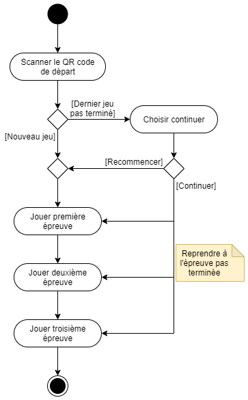
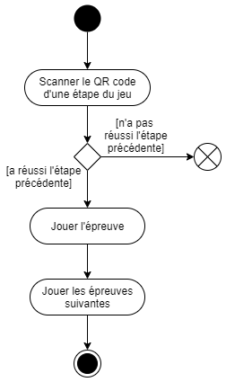
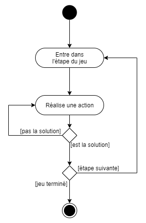

# Analyse fonctionnelle
## Cas d'utilisation
Dans cette partie, nous allons décrire les cas d'utilisation de l'application. Cela nous permettra de comprendre les fonctionnalités que l'application doit offrir aux différents utilisateurs et acteurs.

{ width=50% }

Dans le diagramme ci-dessus, nous pouvons observer qu'il n'y a qu'un acteur qui correspond aux utilisateurs de l'application, ceux qui joueront à l'escape game. Ces utilisateurs pourront participer au jeu d'évasion, cela nécessite (inclus) de scanner un QR code au début du jeu. Ils pourront également participer directement aux 3 étapes du jeu en scannant un QR code pour l'étape désirée mais il faut impérativement qu'ils aient réussi l'étape précédente.  
Les utilisateurs pourront aussi modifier leur profil en changeant leur pseudo.

## Fonctionnement général
{ width=50% }

Tout d'abord, le diagramme ci-dessus présente le fonctionnement du jeu d'évasion dans son ensemble. Les joueurs commencent par scanner le QR code de début du jeu à l'entrée du musée. S'ils ont déjà tenté le jeu sans l'avoir terminé, l'application leur propose de continuer le jeu à l'étape où ils se sont arrêtés. Ils peuvent également choisir de recommencer le jeu depuis le début. Le jeu, au complet, est composé de 3 étapes. Les joueurs doivent réussir chaque étape pour passer à l'étape suivante. Tant qu'ils n'ont pas réussi une étape, ils ne peuvent pas passer à l'étape suivante. Une fois les 3 étapes réussies, le jeu est terminé.

{ width=50% }

Ensuite, le diagramme ci-dessus présente le fonctionnement du jeu d'évasion lorsqu'un joueur reprend le jeu à une étape précise. Cela peut arriver s'il a quitté le jeu avant de le terminer ou s'il a rencontré un problème. Dans ce cas, il doit scanner le QR code de l'étape à laquelle il veut reprendre le jeu. Il pourra y jouer uniquement s'il a réussi l'étape précédente. Il pourra ensuite continuer le jeu jusqu'à la fin.

Enfin, le dernier diagramme de cette partie présente le fonctionnement d'une épreuve. Ce fonctionnement est identique pour chaque étape. Les joueurs doivent trouver la solution pour débloquer la situation dans laquelle ils se trouvent dans le jeu avant de pouvoir passer à l'étape suivante. Pour cela, ils tenteront diverses actions pour trouver la solution. Tant qu'ils n'ont pas trouvé la solution, ils doivent retenter d'autres actions. Une fois la solution réalisée, ils peuvent passer à l'étape suivante s'il y en a une ou terminer le jeu s'ils ont réussi la dernière étape.

{ width=50% }

## Maquettes d'écrans
```md
- Images visuels
- Ne pas oublier d'expliquer brièvement le visuel

- Maquettes
  - Page d'accueil
  - Profil utilisateur
  - Cale de bateau sombre avec tonneaux et sortie un peu éclairée
  - Cale de bateau éclairée à la lampe torche
  - Pont d'un bateau avec capitaine avec bateau ennemi au loin
  - Chargement fusils
  - Cabine du capitaine
```


### Composants nécessaires
```md
- Lister composants nécessaire (bouton, texte, image...) (sur base des maquettes)
```


