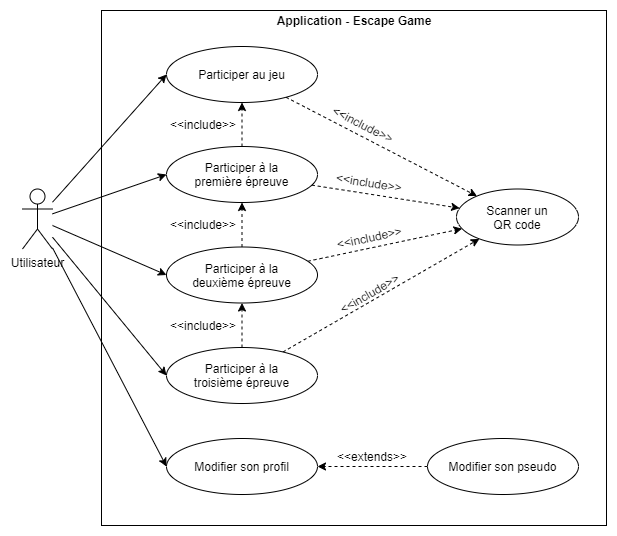

# Analyse fonctionnelle
## Cas d'utilisation
Dans cette partie, nous allons décrire les cas d'utilisation de l'application. Cela nous permettra de comprendre les fonctionnalités que l'application doit offrir aux différents utilisateurs et acteurs.



Dans le diagramme ci-dessus, nous pouvons observer qu'il n'y a qu'un acteur qui correspond aux utilisateur de l'application, ceux qui joueront à l'escape game. Ces utilisateurs pourront participer au jeu d'évasion. Cela nécessite (inclus) de scanner un QR code. Ils pourront également participer aux 3 étapes du jeu en scanant un QR code mais il faut impérativement qu'il ait réussi l'étape précédente.

## Fonctionnement général
```md
- Schéma activité (scénario game)
```


## Maquettes d'écrans
```md
- Images visuels
- Ne pas oublier d'expliquer brièvement le visuel

- Maquettes
  - Cale de bateau sombre avec tonneaux et sortie un peu éclairée
  - Cale de bateau éclairée à la lampe torche
  - Pont d'un bateau avec capitaine avec bateau ennemi au loin
  - Chargement fusils
  - Cabine du capitaine
```


### Composants nécessaires
```md
- Lister composants nécessaire (bouton, texte, image...) (sur base des maquettes)
```


