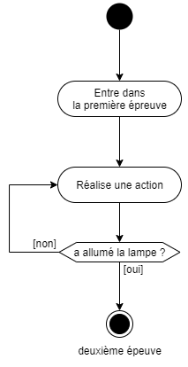
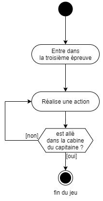
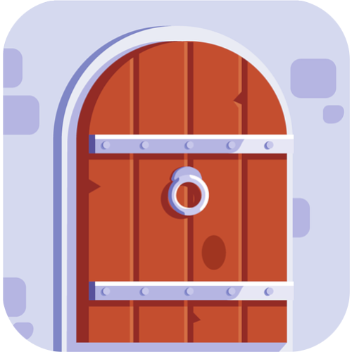
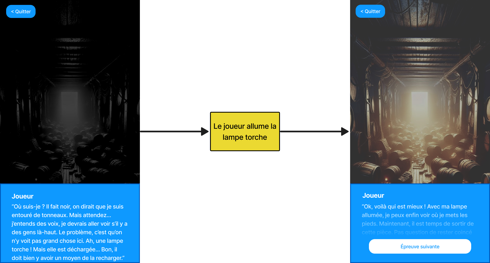
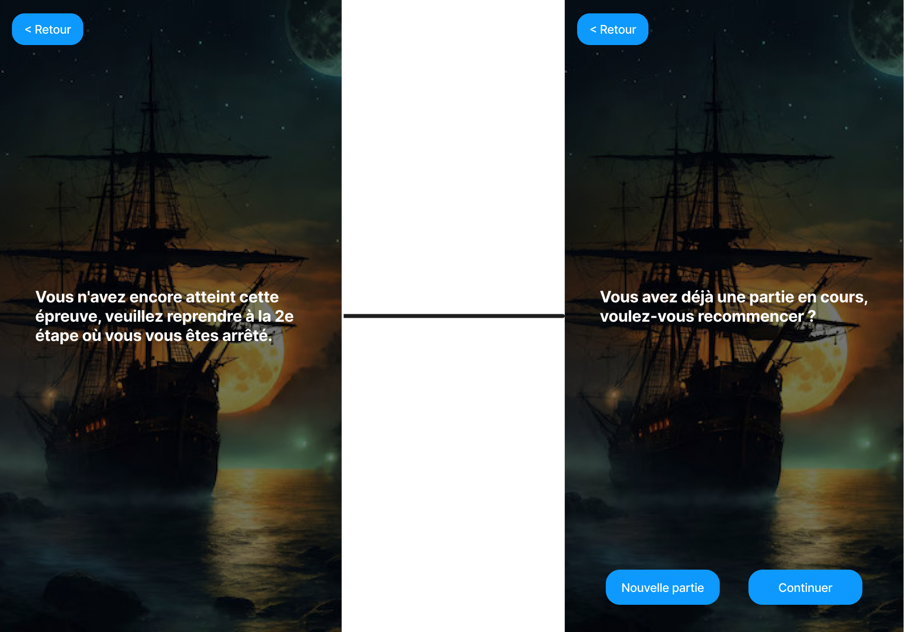

# Analyse fonctionnelle
## Cas d'utilisation
Dans cette partie, nous allons décrire les cas d'utilisation de l'application. Cela nous permettra de comprendre les fonctionnalités que l'application doit offrir aux utilisateurs.

{ width=70% }

Dans le diagramme ci-dessus, nous pouvons observer qu'il n'y a qu'un acteur qui correspond aux utilisateurs de l'application, ceux qui joueront à l'escape game. Les joueurs pourront participer au jeu d'évasion, cela nécessite (inclus) de scanner un QR code au début du jeu. Ils pourront également participer directement aux 3 étapes du jeu en scannant un QR code pour l'étape désirée. Toutefois, il faut impérativement qu'ils aient réussi l'étape précédente pour accéder à l'étape voulue.  
Les utilisateurs pourront aussi modifier leur pseudo avant de jouer.

## Fonctionnement général
La suite de cette partie présente le fonctionnement général de l'application. Nous allons décrire comment les épreuves du jeu d'évasion se déroulent au sein de l'application.

### Diagramme d'états
La succession des épreuves nécessite que les joueurs aient réussi l'épreuve précédente pour accéder à l'épreuve suivante. Pour cela, nous devons comprendre que chaque épreuve passe par plusieurs états au cours de son déroulement. Ces états sont les suivants :

Dans le diagramme ci-dessus, nous pouvons observer que chaque épreuve commence à l'état `"Bloquée"`. Cela signifie que le joueur ne peut pas accéder à l'épreuve tant qu'il n'a pas réussi l'épreuve précédente. Une fois l'épreuve débloquée, il peut y accéder et commencer à jouer. L'épreuve passe ainsi à l'état `"En cours"`. Le joueur peut jouer à l'épreuve jusqu'à ce qu'il trouve la solution. Une fois la solution trouvée, l'épreuve passe à l'état `"Réussie"`. Le joueur peut alors passer à l'épreuve suivante s'il y en a une ou terminer le jeu s'ils ont réussi la dernière épreuve.

### Diagrammes d'activité
Pour mieux comprendre le déroulement du jeu d'évasion, nous avons réalisé plusieurs diagrammes d'activité. Ces diagrammes permettent de visualiser le fonctionnement du jeu dans son ensemble et de chaque épreuve en particulier.

{ width=50% }

Tout d'abord, le diagramme ci-dessus présente le fonctionnement du jeu d'évasion dans son ensemble. Le joueur commence par scanner le QR code de début du jeu à l'entrée du musée. S'il a déjà tenté le jeu sans l'avoir terminé, l'application lui propose de continuer le jeu à l'étape où il s'est arrêté. Il peut également choisir de recommencer le jeu depuis le début. Le jeu, au complet, est composé de 3 étapes. Tant que le joueur n'a pas réussi une étape, il ne peut pas passer à l'étape suivante. Une fois les 3 étapes réussies, le jeu est terminé.

{ width=40% }

Ensuite, le diagramme ci-dessus présente le fonctionnement du jeu d'évasion lorsqu'un joueur veut reprendre le jeu à une étape précise. Cela peut arriver s'il a quitté le jeu avant de le terminer ou s'il a rencontré un problème. Dans ce cas, il doit scanner le QR code de l'étape à laquelle il veut reprendre le jeu. Il pourra y jouer uniquement s'il a réussi l'étape précédente. Il pourra ensuite continuer le jeu jusqu'à la fin.

Enfin, les trois diagrammes suivants présentent le fonctionnement de chaque épreuve. Dans la première épreuve, le joueur doit allumer la lumière pour sortir de la cale et réussir l'étape. Dans la deuxième épreuve, il doit tasser la poudre d'un canon pour attaquer un bateau ennemi. Dans la troisième épreuve, il doit se rendre dans la cabine du capitaine pour fêter la victoire. Dans chaque épreuve, la situation reste au même point tant que la solution n'a pas été trouvée. Une fois la solution trouvée, le joueur peut passer à l'étape suivante s'il y en a une ou terminer le jeu s'il a réussi la dernière étape.

{ width=40% }

{ width=40% }

{ width=40% }

\newpage

## Maquettes d'écrans
### Présentation des maquettes
Pour mieux visualiser les écrans de l'application, nous avons réalisé des maquettes. Ces maquettes permettent de fixer les visuels des écrans et de comprendre comment ils sont organisés et comment les utilisateurs peuvent interagir avec eux.

1. Icône de l'application

{ width=30% }

L'icône de l'application est l'image qui apparaît sur l'écran d'accueil du téléphone. Elle permet de lancer l'application en cliquant dessus.

\newpage

2. Page d'accueil

{ width=50% }

L'écran d'accueil est la première page qui apparaît lorsque l'application est lancée. Elle permet à l'utilisateur de choisir un pseudo pour jouer et de commencer le jeu.

\newpage

3. Page de scan de QR code

{ width=50% }

L'écran de scan de QR code est lancée après la page d'accueil. Elle permet à l'utilisateur de scanner un QR code pour commencer un jeu ou une épreuve en particulier. La maquette de cet écran montre un QR code à scanner, ce n'est qu'une représentation visuelle. Dans l'application, la page aura la caméra en plein écran avec un bouton dans le bas de l'écran pour scanner le QR code.

\newpage

4. Page d'introduction au jeu

{ width=50% }

Cette page d'introduction a pour objectif de présenter le jeu et son contexte au joueur. Elle est lancée après le scan du QR code de début du jeu.

\newpage

5. Première épreuve

La première épreuve se passe dans la cale du bateau. Le joueur doit illuminer la cale pour pouvoir en sortir. C'est pour cela que la première partie, à gauche, de la maquette montre la cale dans le noir. Ensuite, après avoir allumé une lumière, la cale est illuminée et le joueur peut sortir. C'est ce que montre la deuxième partie, à droite, de la maquette.

\newpage

6. Deuxième épreuve

La deuxième épreuve se déroule sur le pont du bateau. Le joueur est accueilli par le capitaine du bateau qui lui demande de l'aider pour charger les canons afin d'attaquer un bateau ennemi. Le joueur doit préparer le canon qui se trouve devant-lui. Après cela, il vit le combat. Cependant, pour des raison d'images violentes, il ne verra qu'un joli chat pirate à la place d'un combat. C'est ce que montre la deuxième partie de la maquette de l'écran de la deuxième épreuve.

Il est intéressant de remarquer que les premiers dialogues ont une mention "Suivant..." en bas à droite. Cela indique au joueur qu'il y a un dialogue après celui affiché.

\newpage

7. Troisième épreuve

Pour la troisième épreuve, le joueur retrouve le capitaine qui le félicite et le remercie pour son aide précieuse. Il lui propose de se rendre dans sa cabine pour fêter la victoire. Quand le joueur y arrive, le capitaine lui offre un verre de rhum.

\newpage

8. Page de fin de jeu

{ width=50% }

La page de fin de jeu est la dernière page qui apparaît lorsque le joueur a terminé le jeu. Elle le félicite pour sa victoire et lui propose de revenir à l'écran d'accueil.

\newpage

9. Page d'accès refusé

La page d'accès refusé est une page qui apparaît lorsque l'utilisateur tente d'accéder à une étape pour laquelle il n'a pas accès. Elle lui propose de revenir à l'écran d'accueil. La deuxième partie de la maquette correspond à l'écran lorsque le joueur veut commencer une partie alors qu'il en a déjà une en cours. Il peut choisir de continuer la partie en cours ou de recommencer le jeu.

\newpage

10. Page non trouvée

{ width=50% }

La page non trouvée est une page qui apparaît lorsque l'utilisateur tente d'accéder à une page qui n'existe pas dans l'application. Elle lui propose de revenir à l'écran d'accueil.

\newpage

### Navigation entre les écrans
Les maquettes d'écrans présentées ci-dessus permettent de visualiser les différentes pages de l'application. Pour naviguer entre ces écrans, nous avons réalisé un diagramme de navigation. Ce diagramme permet de comprendre comment les utilisateurs peuvent passer d'un écran à un autre.

{ width=70% }

Dans ce diagramme, nous pouvons observer que l'utilisateur commence par l'icône de l'application qui le mène à l'écran d'accueil. De là, il peut scanner un QR code pour commencer le jeu ou une épreuve en particulier. S'il n'a pas accès à l'épreuve, il est redirigé vers l'écran d'accès refusé. Sinon, il peut commencer l'épreuve. En réussissant l'épreuve, il peut passer à l'épreuve suivante jusqu'à la dernière. Une fois le jeu terminé, il est redirigé vers l'écran de fin de jeu qui lui permet de revenir à l'écran d'accueil.

Dans ce diagramme, les flèches indiquent le sens de navigation entre les écrans. Les flèches en noir indiquent les chemins normaux de navigation. Les flèches en bleu indiquent les chemins de retour et les flèches en rouge indiquent les chemins d'accès refusé.

La page non trouvée n'est pas reliée aux autres écrans car elle n'est pas accessible depuis l'application. Elle est affichée uniquement lorsque l'utilisateur tente d'accéder à une page qui n'existe pas.

### Composants graphiques
Pour réaliser ces maquettes, plusieurs éléments peuvent être rééutilisés. Voici une liste, non-exhaustive, des composants nécessaires pour réaliser les maquettes d'écrans de l'application :

- Un bouton d'action
- Un bouton de retour
- Un panel de texte qui contiendra les dialogues des personnages

Ces composants et les écrans utiliseront des éléments graphiques tels que :

- Du texte
- Des images
- Des boutons
- Un champ d'entrée pour le pseudo

Enfin, les maquettes utilisent un code couleur pour les éléments graphiques :

- Les éléments en bleu (boutons et panel) utilisent la couleur `#1E90FF`
  - les boutons deviennent en bleu foncé à l'appui : `#1F5D99`
  - Les textes disposés sur un fond bleu sont en blanc : `#FFFFFF`
- Les textes sur fond blanc sont en noir : `#000000`
