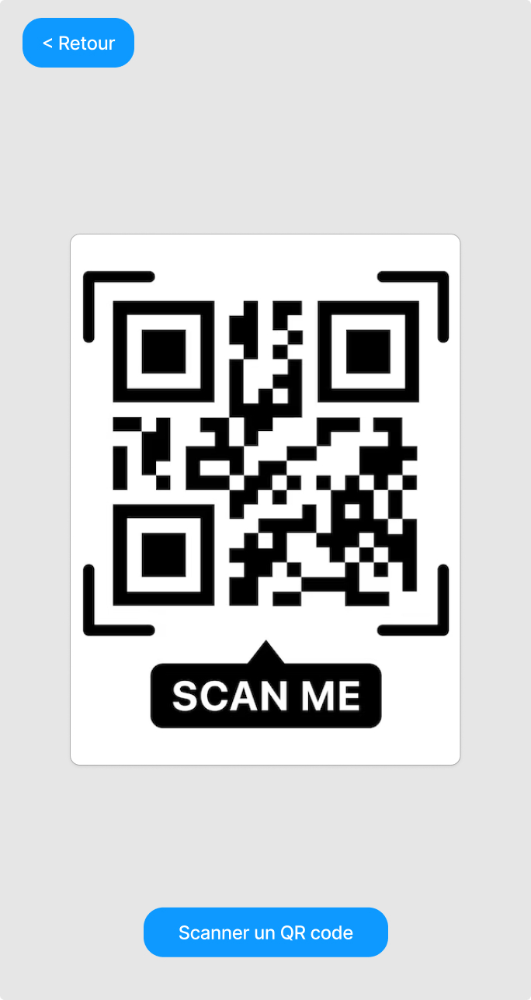
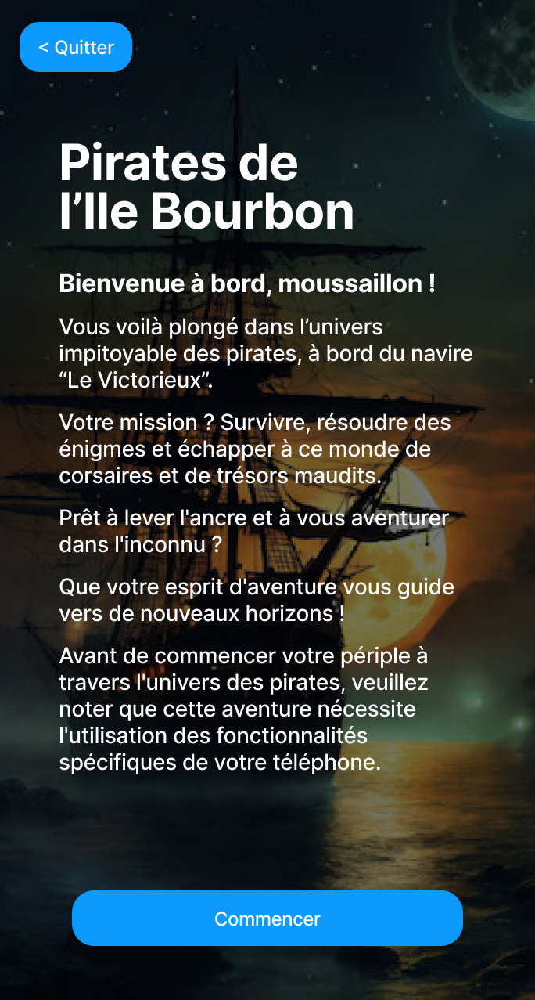
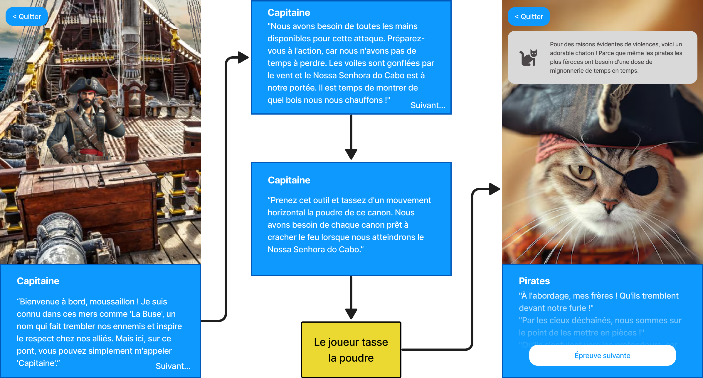
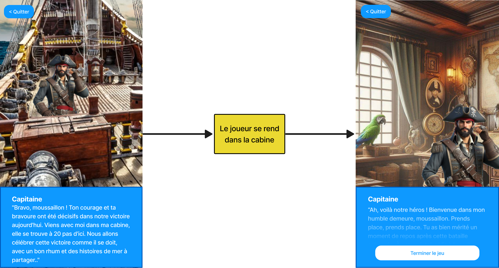

# Analyse fonctionnelle
## Cas d'utilisation
Dans cette partie, nous allons décrire les cas d'utilisation de l'application. Cela nous permettra de comprendre les fonctionnalités que l'application doit offrir aux différents utilisateurs et acteurs.

{ width=50% }

Dans le diagramme ci-dessus, nous pouvons observer qu'il n'y a qu'un acteur qui correspond aux utilisateurs de l'application, ceux qui joueront à l'escape game. Ces utilisateurs pourront participer au jeu d'évasion, cela nécessite (inclus) de scanner un QR code au début du jeu. Ils pourront également participer directement aux 3 étapes du jeu en scannant un QR code pour l'étape désirée mais il faut impérativement qu'ils aient réussi l'étape précédente.  
Les utilisateurs pourront aussi modifier leur profil en changeant leur pseudo.

## Fonctionnement général
{ width=50% }

Tout d'abord, le diagramme ci-dessus présente le fonctionnement du jeu d'évasion dans son ensemble. Les joueurs commencent par scanner le QR code de début du jeu à l'entrée du musée. S'ils ont déjà tenté le jeu sans l'avoir terminé, l'application leur propose de continuer le jeu à l'étape où ils se sont arrêtés. Ils peuvent également choisir de recommencer le jeu depuis le début. Le jeu, au complet, est composé de 3 étapes. Les joueurs doivent réussir chaque étape pour passer à l'étape suivante. Tant qu'ils n'ont pas réussi une étape, ils ne peuvent pas passer à l'étape suivante. Une fois les 3 étapes réussies, le jeu est terminé.

{ width=50% }

Ensuite, le diagramme ci-dessus présente le fonctionnement du jeu d'évasion lorsqu'un joueur reprend le jeu à une étape précise. Cela peut arriver s'il a quitté le jeu avant de le terminer ou s'il a rencontré un problème. Dans ce cas, il doit scanner le QR code de l'étape à laquelle il veut reprendre le jeu. Il pourra y jouer uniquement s'il a réussi l'étape précédente. Il pourra ensuite continuer le jeu jusqu'à la fin.

Enfin, le dernier diagramme de cette partie présente le fonctionnement d'une épreuve. Ce fonctionnement est identique pour chaque étape. Les joueurs doivent trouver la solution pour débloquer la situation dans laquelle ils se trouvent dans le jeu avant de pouvoir passer à l'étape suivante. Pour cela, ils tenteront diverses actions pour trouver la solution. Tant qu'ils n'ont pas trouvé la solution, ils doivent retenter d'autres actions. Une fois la solution réalisée, ils peuvent passer à l'étape suivante s'il y en a une ou terminer le jeu s'ils ont réussi la dernière étape.

{ width=50% }

## Maquettes d'écrans
1. Icône de l'application

{ width=50% }

L'icône de l'application est l'image qui apparaît sur l'écran d'accueil du téléphone. Elle permet de lancer l'application en cliquant dessus.

1. Page d'accueil

{ width=50% }

L'écran d'accueil est la première page qui apparaît lorsque l'application est lancée. Elle permet à l'utilisateur de choisir un pseudo pour jouer et de commencer le jeu.

1. Page de scan de QR code

L'écran de scan de QR code est lancée après la page d'accueil. Elle permet à l'utilisateur de scanner un QR code pour commencer un jeu ou une éprouve en particulier. La maquette de cet écran montre un QR code à scanner, ce n'est qu'une représentation visuelle. Dans l'application, la page aura la caméra en plein écran avec un bouton dans le bas de l'écran pour scanner le QR code.

1. Page d'introduction au jeu

{ width=50% }

Cette page d'introduction a pour objectif de présenter le jeu et son contexte au joueur. Elle est lancée après le scan du QR code de début du jeu.

1. Première épreuve

La première épreuve se passe dans la cale du bateau. Les joueurs doivent illuminer la cale pour pouvoir en sortir. C'est pour cela que la première partie, à gauche, de la maquette montre la cale dans le noir. Ensuite, après que le joueur ait allumé une lumière, la cale est illuminée et le joueur peut sortir. C'est ce que montre la deuxième partie, à droite, de la maquette.

1. Deuxième épreuve

La deuxième épreuve se passe sur le pont du bateau. Les joueurs sont accueillis par le capitaine du bateau qui leur demande de l'aider à charger les canons pour attaquer un bateau ennemi. Les joueurs doivent charger le canon qui se trouve devant-eux. Après cela, ils vivent le combat. Cependant, pour des raison d'images violentes, ils verront un joli chat pirate à la place d'un combat. C'est ce que montre la deuxième partie de la maquette de l'écran de la deuxième épreuve. 

1. Troisième épreuve

Pour la troisième épreuve, nous retrouvons le capitaine qui félicite et remercie le joueur pour son aide précieuse. Il lui propose de se rendre dans sa cabine pour fêter la victoire. Quand le joueur y arrive, le capitaine lui offre un verre de rhum.

### Composants graphiques
Pour réaliser ces maquettes, plusieurs éléments peuvent être rééutiliser. Voici une liste des composants nécessaires pour réaliser les maquettes d'écrans de l'application :
- Un bouton d'action
- Un bouton de retour
- Un panel de texte qui contiendra les dialogues des personnages

Ces composants et les écrans utiliserons des éléments graphiques tels que :
- Du texte
- Des images
- Des boutons
- Un champ d'entrée pour le pseudo

Enfin, les maquettes utilisent un code couleur pour les éléments graphiques :
- Les éléments en bleu (boutons et panel) utilisent la couleur `#1E90FF`
  - les boutons deviennent en bleu foncé à l'appui : `#1F5D99`
  - Les textes disposé sur un fond bleu sont en blanc : `#FFFFFF`
- Les textes sur fond blanc sont en noir : `#000000`
