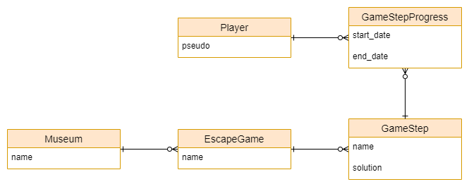
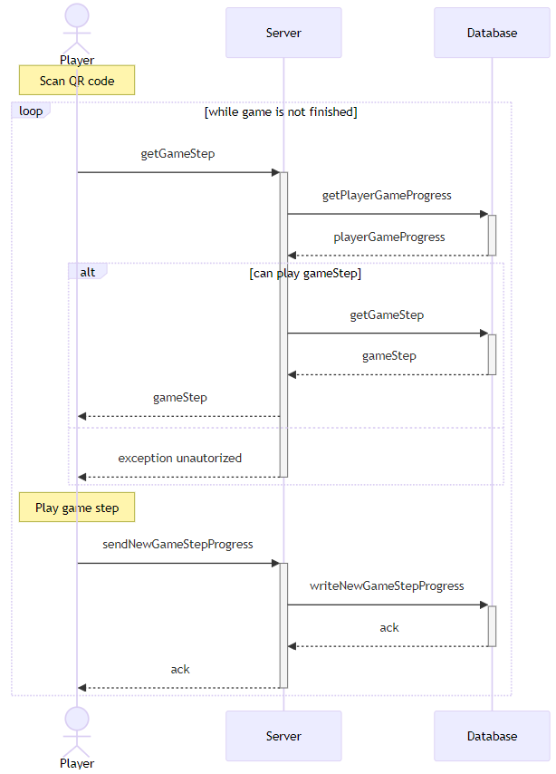

# Possibilités d'amélioration
Dans cette dernière partie, nous allons évoquer quelques pistes d'amélioration pour l'application. Ces pistes sont des idées qui pourraient être implémentées pour améliorer l'expérience utilisateur ou pour ajouter des fonctionnalités supplémentaires à l'application.

## Indices de jeu
Dans l'état actuel de l'application, il se peut que certains joueurs soient bloqués à certaines étapes du jeu. Pour les aider, nous pourrions ajouter un système d'indices qui permettrait aux joueurs de demander des indices pour les aider à avancer dans le jeu. Ces indices pourraient être débloqués après un certain temps passé sur une étape. Par exemple, si un joueur est bloqué sur une étape depuis 5 minutes, il pourrait demander un indice pour l'aider à avancer.

Cet ajout demanderait d'adapter l'interface utilisateur des épreuves pour permettre aux joueurs de demander des indices.

## Paramétrisation de l'application
### Multi-langues
Pour toucher un public plus large, il serait intéressant de permettre à l'application d'être disponible en plusieurs langues. Cela permettrait aux utilisateurs de choisir la langue dans laquelle ils souhaitent jouer. Pour cela, il faudrait ajouter un système de traduction dans l'application qui permettrait de traduire les textes de l'application dans différentes langues. Un module possible pour gérer l'internationalisation est [react-i18next](https://react.i18next.com/).

### Audio
Pour les personnes malvoyantes, il serait intéressant d'ajouter un système audio qui permettrait de lire les textes à haute voix. Cela permettrait aux personnes malvoyantes de jouer à l'application sans avoir besoin de lire les textes à l'écran.

Pour jouer des pistes audio, nous pourrions utiliser le module [Audio](https://docs.expo.dev/versions/latest/sdk/audio/) de React Native / Expo.

### Accessibilité
Toujours dans un objectif d'inclusion, il serait intéressant de se pencher sur l'accessibilité de l'application. Cela pourrait passer par l'ajout d'un paramètre qui permettrait de modifier la taille des textes à l'écran ou par l'ajout d'un mode sombre pour les personnes sensibles à la lumière.

L'implémentation de ce paramètrage nécessiterait d'ajouter un système de paramètres dans l'application qui permettrait aux utilisateurs de personnaliser leur expérience d'utilisation. Les valeurs des paramètres seraient stockées dans le stockage de l'application.

## Inclure de nouvelles expositions
Dans un objectif plus orienté business, il serait intéressant de permettre à l'application d'inclure de nouvelles expositions avec leur propre jeu d'évasion ainsi que d'autres musées. Cela permettrait de diversifier l'offre et de proposer des jeux d'évasion différents dans chaque musée rassemblés dans une seule et même application.

Cette fonctionnalité nécessiterait un travail de développement considérable par rapport à ce qui est initiallement prévu mais elle amènerait une plus-value énorme à l'application.

### Stockage de données
Le gros du travail se situerait au niveau du stockage des données. Il faudrait revoir toute la structure de données afin de pouvoir retenir le fonctionnement de tous les jeux d'évasion. Cela permettrait d'ajouter, modifier ou supprimer les jeux d'évasion sans pour autant devoir altérer le code source de l'application. Il faudrait également revoir le stockage des données de jeu pour permettre à l'application de gérer plusieurs parties en même temps. Un joueur pourrait ainsi avoir joué à plusieurs jeux d'évasion pour lesquels il faut retenir sa progression.

Ce changement dans le stockage des données nécessiterait de revoir la manière dont les données sont stockées. Dans l'état initial, les données sont stockées localement dans l'AsyncStorage de l'application mais cette solution serait dépassée pour gérer plusieurs jeux d'évasion et retenir une structure de données plus complexe. Il faudrait donc envisager de stocker les données dans une base de données de type SQL ou NoSQL.

Une première ébauche de structure de données pour une base de données relationnelle (SQL) pourrait être la suivante :

Cette ébauche est non-contractuelle et doit être affinée pour correspondre aux besoins de l'application. Elle permet d'avoir une première idée de la structure de données nécessaire pour gérer plusieurs jeux d'évasion. Dans cette structure, on peut voir les tables `EscapeGame`, `GameStep` et `Museum` qui permettent de gérer respectivement les jeux d'évasion, les étapes de jeu et les musées. Ensemble, elles permettent de retenir les données nécessaires pour gérer plusieurs jeux d'évasion. Ensuite, les tables `Player` et `GameStepProgress` permettent de retenir les données de progression du joueur pour chaque jeu d'évasion.

## Centraliser les données des joueurs
### Statistiques de jeu
Il pourrait être intéressant, pour les musées, de pouvoir prendre connaissance de statistiques sur les joueurs et leurs tentatives de jeu. Cela nécessiterait de centraliser les données des joueurs sur un serveur externe. Les données seraient ainsi disponibles pour les musées qui pourraient les utiliser pour améliorer leur offre ou pour analyser le comportement des joueurs.

Cette fonctionnalité nécessiterait, en plus de la centralisation des données, de créer une application web pour les musées qui leur permettrait de consulter les données des joueurs pour leurs expositions.

### Stockage des données de jeu
Pour faire un lien avec la fonctionnalité d'inclure de nouveaux jeux d'évasion, le changement de stockage des données vers une base de données permettrait une transition plus facile vers cette centralisation des données. De plus, la centralisation du stockage des données de fonctionnement des jeux d'évasion permettrait de ne pas surcharger les appareils mobiles des utilisateurs.

Ainsi, les appareils des joueurs communiqueraient avec le serveur pour récupérer les données de jeu (fonctionnement étapes etc) et pour enregistrer et récupérer leur progression. Les échanges entre l'application et le serveur se dérouleraient comme illustré dans le diagramme suivant :

Dans ce diagramme, on peut observer que l'application communique avec le serveur pour récupérer les données de jeu de l'épreuve demandée, avant de jouer, et pour enregistrer la progression du joueur, une fois l'épreuve réussie. Le serveur stocke les données des joueurs et des jeux d'évasion et les renvoie à l'application lorsque cela est nécessaire.
